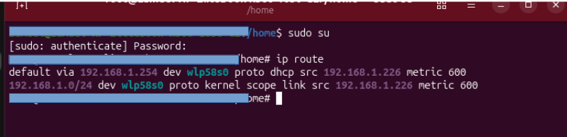
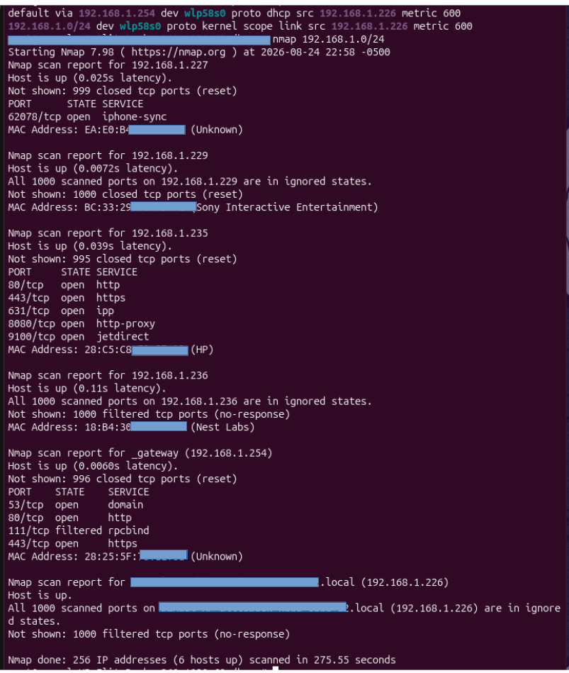
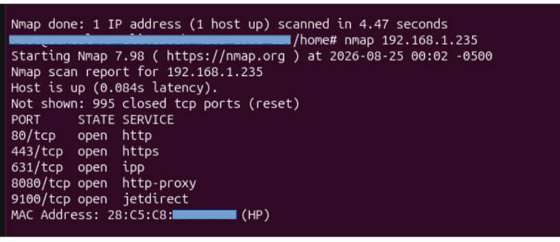
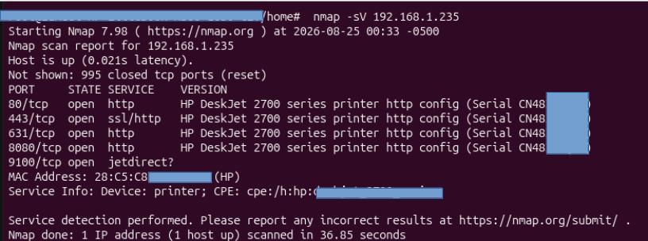
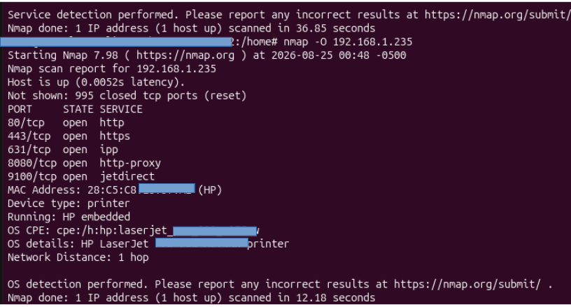
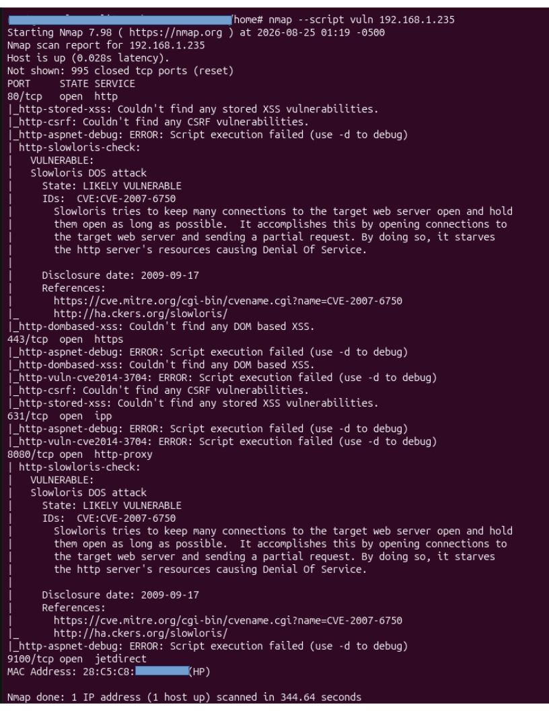

# Nmap Home Network Assessment 

This document walks through the full process, in the order it was performed, with screenshots and reasoning for each step.

---

## Identifying My IP Range

Before scanning, I identified my own subnet using:

```
ip route
```



**Note:** I ran subsequent commands from a root shell (`sudo su`) rather than prefixing every command with `sudo`.

---

## 2. Host Discovery — Find Live Devices on the Network

**Goal:** Identify which IP addresses on the local subnet are active.

```
nmap 192.168.1.0/24
```



This scan found 6 live hosts out of 256 possible addresses in the subnet, including my own laptop, a phone, a game console, a smart-home device, a networked printer, and the gateway/router.

---

## 3. Port Scanning — Check Open Ports on a Target Device

**Goal:** Determine which ports are open on a specific device.

I selected the HP printer (192.168.1.235) as the primary target for deeper analysis:

```
nmap 192.168.1.235
```



Result: 5 open ports: 80, 443, 631, 8080, 9100.

---

## 4. Service / Version Detection

**Goal:** Identify the actual software and version behind each open port, rather than just guessing from the port number.

```
nmap -sV 192.168.1.235
```



This revealed the device as an **HP DeskJet 2700 series printer**, with each web-facing port running the printer's embedded HTTP config service.

---

## 5. OS Fingerprinting

**Goal:** Guess the underlying OS/device type based on how it responds to network probes.

```
nmap -O 192.168.1.235
```



Result: Correctly identified as an embedded printer device (HP LaserJet-family OS fingerprint), one network hop away.

---

## 6. Vulnerability Scanning (NSE Scripts)

**Goal:** Use Nmap's built-in scripting engine to check for known vulnerabilities.

```
nmap --script vuln 192.168.1.235
```



**Result:** Both port 80 and port 8080 were flagged **"LIKELY VULNERABLE"** to a **Slowloris Denial-of-Service attack** (CVE-2007-6750). Slowloris works by opening many partial HTTP connections and holding them open, exhausting the target's connection pool until it can no longer respond to legitimate requests.

---

## 7. Network Inventory / Asset Mapping

**Goal:** Turn scattered scan results into an organized picture of everything on the network, with a basic risk rating for each device.

| IP | Device | Open Ports | Notes | Risk Level | Last Scanned |
|---|---|---|---|---|---|
| 192.168.1.226 | My laptop | none visible | host itself | Low | 8/24/26 |
| 192.168.1.227 | Unknown (iPhone-sync) | 62078 | likely a phone/iOS device | Low | 8/24/26 |
| 192.168.1.229 | Sony Interactive Entertainment | none open | likely a PlayStation | Low | 8/24/26 |
| 192.168.1.235 | HP printer | 80, 443, 631, 8080, 9100 | flagged Slowloris on 80/8080 | **High** | 8/24/26 |
| 192.168.1.236 | Nest Labs | none open | smart home device (thermostat/camera) | Low | 8/24/26 |
| 192.168.1.254 | Gateway/router | 53, 80, 111 (filtered), 443 | router's admin panel | Medium | 8/24/26 |

**Risk rating logic:** Risk level reflects a combination of (1) exposure — is anything actually listening, (2) whether a known vulnerability was confirmed via scan, and (3) potential impact if compromised. The printer is the only device where all three factors line up (multiple open ports + a named CVE + reachable on the LAN), which is why it's rated High.

---

## 8. Firewall / Security Audit

**Goal:** Determine whether each open port on the printer is actually necessary, or represents unnecessary attack surface.

**Target: HP Printer (192.168.1.235)**

| Port | Service | Expected? | Notes |
|---|---|---|---|
| 80/tcp | http | Yes | Web admin config interface |
| 443/tcp | https | Yes | Encrypted web admin config interface |
| 631/tcp | ipp | Yes | Internet Printing Protocol — how print jobs are sent over the network |
| 8080/tcp | http (mislabeled "http-proxy") | **Flag** | Duplicate web admin interface on an alternate port |
| 9100/tcp | jetdirect | Yes | HP's raw TCP printing protocol, kept for legacy compatibility |

### Finding
The printer exposes its web management interface on two separate ports (80 and 8080), both flagged vulnerable to Slowloris DoS in the NSE vulnerability scan.

### Risk
Doubled attack surface for the same interface — two reachable paths into the same exploitable service.

### Recommendation
Disable the secondary web interface on port 8080 if the printer's admin settings allow it, since ports 80/443 already provide the same functionality.

---

## 9. Compliance Baseline Check

**Goal:** Compare scan results against a simple written security baseline, rather than relying on ad-hoc judgment alone.

**Example baseline policy used:**
1. No device should expose Telnet (23) or FTP (21) — insecure, unencrypted protocols.
2. Any web admin interface must use HTTPS (443), not plain HTTP (80).
3. No device should expose more than one instance of the same service on different ports.

| Rule | Printer (192.168.1.235) | Router (192.168.1.254) |
|---|---|---|
| 1. No Telnet/FTP exposed | Pass — neither port open | Pass — neither port open |
| 2. Admin interface must use HTTPS, not just HTTP | Fail — port 80 (plain HTTP) is open alongside 443 | Fail — port 80 is open; no evidence of forced HTTPS |
| 3. No duplicate service on multiple ports | Fail — web admin service duplicated on 80 and 8080 | Pass — no duplicated services observed |

**Conclusion:** The printer fails 2 of 3 baseline checks, reinforcing the firewall audit finding above. The router fails the HTTPS-enforcement rule and would benefit from confirming whether its plain-HTTP admin login can be disabled in favor of HTTPS-only access.

---

## Tools Used
- Nmap 7.98
- Ubuntu Linux (bash/root shell)

## Scope & Authorization
All scans were performed against my own home network and personally owned devices only, with full authorization as the network owner. No external, third-party, or unauthorized systems were scanned or tested.
